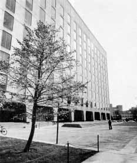
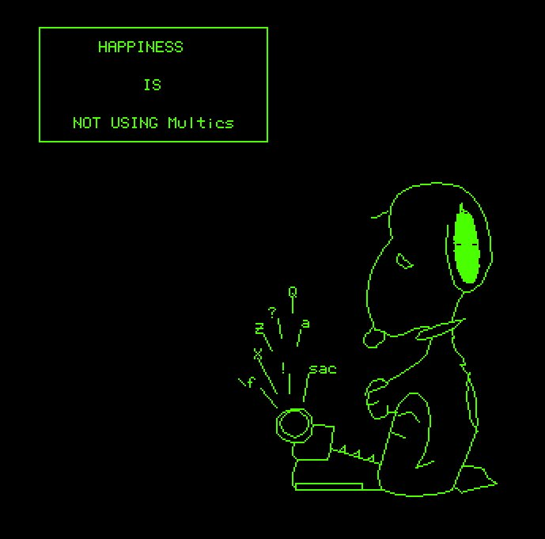
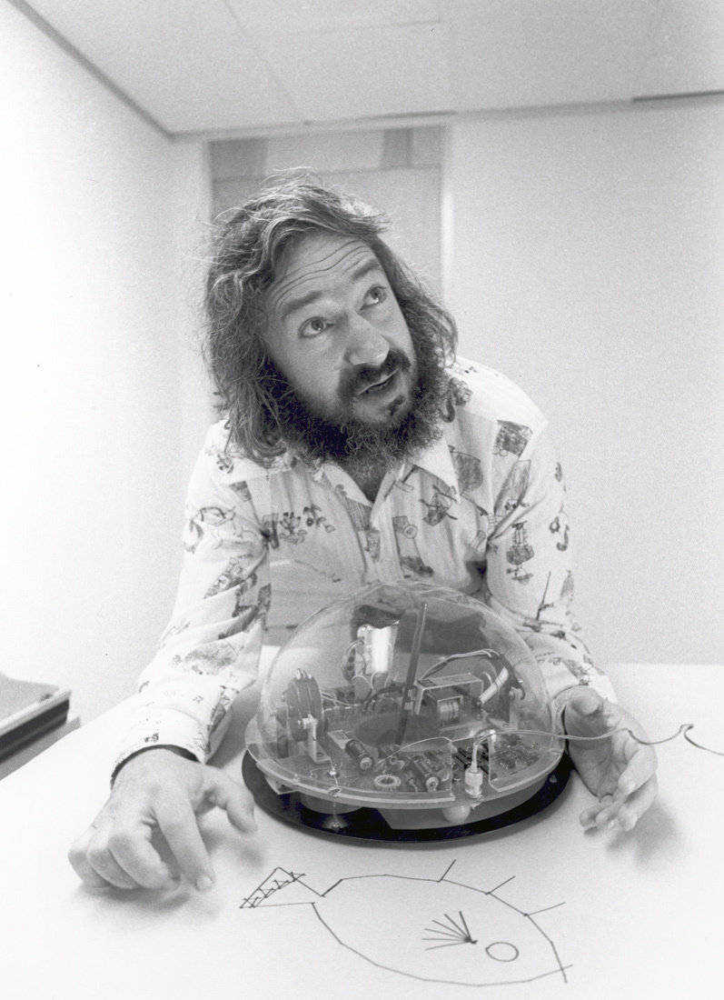
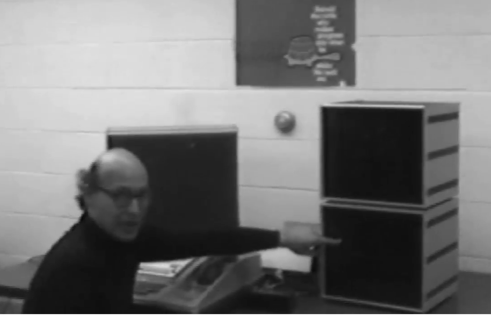
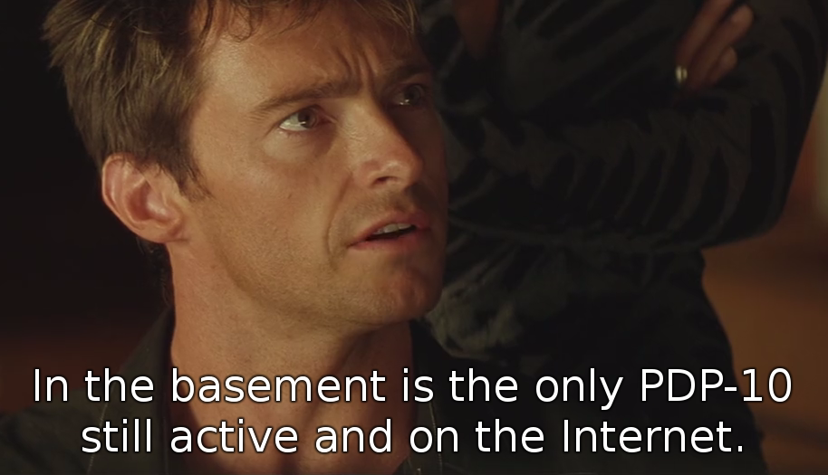
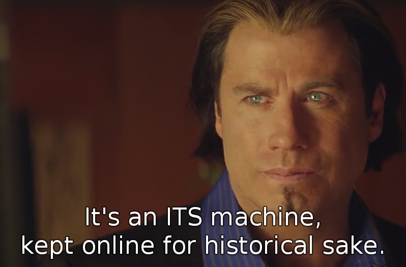

#### INCOMPATIBLE TIMESHARING SYSTEM

History, Development, and Restoration

Lars Brinkhoff

</img>

---?image=pics/bg2.jpg

### OVERVIEW

- What is ITS?
- History
- Values
- Features
- Today
- Demo

---?image=pics/bg2.jpg

### BUZZWORDS

 
Logo&nbsp;&nbsp;&nbsp;&nbsp;Lisp&nbsp;&nbsp;&nbsp;&nbsp;C&nbsp;&nbsp;&nbsp;&nbsp;Yacc 
&nbsp;&nbsp;Zork&nbsp;&nbsp;&nbsp;&nbsp;Videogames&nbsp;&nbsp;&nbsp;&nbsp;Chess 
Typesetting&nbsp;&nbsp;&nbsp;&nbsp;AI&nbsp;&nbsp;&nbsp;&nbsp;Robotics 
Emacs&nbsp;&nbsp;&nbsp;&nbsp;&nbsp;Macsyma&nbsp;&nbsp;&nbsp;&nbsp;Multics&nbsp;&nbsp;&nbsp;&nbsp;CAD 
&nbsp;&nbsp;ARPANET&nbsp;&nbsp;&nbsp;&nbsp;SAIL&nbsp;&nbsp;&nbsp;&nbsp;BBN&nbsp;&nbsp;&nbsp;&nbsp;DEC

---?image=pics/bg2.jpg

### WHY DO THIS?

- Started with BASIC, then 68000 assembler
- Read about hackers as a kid
- Binutils PDP-11 support
- GCC PDP-10 support
- More fun than playing games

</img>
</img>

---?image=pics/bg2.jpg

### WHAT IS ITS?

- ITS is an operating system for PDP-10 computers.
- Created at MIT in 1967, kept running until 1990.
- Known for its openness and lack of security.

</img>
</img>

---?image=pics/bg2.jpg

### PDP-10 FAMILY

- Made by Digital Equipment Corporation
- Lifespan 1964-1988
- Generations: PDP-6, KA10, KI10, KL10, KS10
- Designed with Lisp in mind
- 36-bit word length, 18-bit address space
- Large orthogonal instruction set
- Pleasant assembly language
- Popular on the ARPANET

</img>

---?image=pics/bg2.jpg

### BEFORE ITS

- AI group 1959
- CTSS 1961-1963
- Project MAC 1963
- Multics 1964-1967

</img>
</img>

---?image=pics/bg2.jpg

### BEGINNINGS

- At the Project MAC AI group
- For their PDP-6 computer
- Grew from singe-user tools
- First version 1967
- Alternative to CTSS and Multics

</img>
</img>

---?image=pics/bg2.jpg

### HACKER ETHIC

<ul>
<li>ITS was written by hackers</li>
<li>Designed to get work done, not an academic exercise</li>
<li>Highly interactive</li>
<li>No passwords (until later)</li>
<li>No file permissions</li>
<li>Source code for everything</li>
<li>Guests allowed</li>
</ul>

</img>

---?image=pics/bg2.jpg

### EARLY DEVELOPMENT

- AI PDP-10 1968
- Virtual memory 1970
- ARPANET 1971
- Two more machines: DM and ML

</img>
</img>
</img>

---?image=pics/bg2.jpg

### RESEARCH

<ul>
<li>AI</li>
<li>Robotics</li>
<li>Computer Vision</li>
<li>Logo</li>
<li>Lisp, Scheme</li>
<li>Lisp Machine</li>
<li>Macsyma</li>
<li>Networking</li>
</ul>

</img>
</img>
</img>

+++?image=pics/bg2.jpg

### LISP

<ul>
<li>Invented 1958 by John McCarthy</li>
<li>Initially for IBM 704 by Steve Russell</li>
<li>Ported to PDP-6</li>
<li>Maclisp for ITS</li>
<li>Compiler competetive with Fortran</li>
<li>Lisp machine by Greenblatt and Knight</li>
<li>Scheme by Guy Steele</li>
</ul>

</img>
</img>
</img>

+++?image=pics/bg2.jpg

### LOGO

<ul>
<li>BBN 1967 by Feurzeig, Papert, Solomon</li>
<li>Moved to MIT 1970</li>
<li>PDP-10 version ported to ITS</li>
<li>New versions for PDP-11, Maclisp, Apple II... </li>
<li>Developed on ITS</li>
<li>General Turtle, Logo machine</li>
</ul>

</img>
</img>

---?image=pics/bg2.jpg

### HEYDAYS

- Network file system
- Memory mapped raster displays
- Space cadet-like keyboards
- MC KL10 1975
- Emacs 1976
- TCP/IP 1982

</img>
</img>

---?image=pics/bg2.jpg

### NOTABLE PROGRAMS

<ul>
<li>Maclisp</li>
<li>Macsyma</li>
<li>Emacs</li>
<li>Scheme</li>
<li>SHRDLU</li>
<li>Muddle</li>
</ul>

 

---?image=pics/bg2.jpg

### GAMES

<ul>
<li>Spacewar!</li>
<li>MacHack VI</li>
<li>Flight simulator</li>
<li>Adventure</li>
</ul>

<ul>
<li>Maze War</li>
<li>Dazzle Dart</li>
<li>Moonlander</li>
<li>Zork</li>
</ul>

</img>
</img>
</img>
</img>
</img>

---?image=pics/bg2.jpg

### IMPORTED SOFTWARE

- Emulator for TOPS-10 and WAITS system calls.
- Collaboration between PDP-10 sites.
- DEC: MACRO, LINK, CROSS, Fortran.
- SAIL: FAIL, SPELL, SUDS, TeX, PUB, GEOMED.
- CMU: Scribe.

</img>
</img>

---?image=pics/bg2.jpg

### MULTIPROCESSING

<ul>
<li>PDP-10, timesharing</li>
<li>PDP-6, stand alone</li>
<li>PDP-11, perpiherals</li>
<li>CONS, Lisp machine</li>
<li>CHEOPS, chess machine</li>
<li>GT40, vector display</li>
<li>Imlac, vector display</li>
<li>Tools and software</li>
</ul>

</img>
</img>
</img>

---?image=pics/bg2.jpg

### FEATURES AND LIMITATIONS

- PCLSR, PC lusering
- Processes & processors available as files
- The debugger is the user interface
- Application command sets are similar to Emacs
- User-space device drivers
- Real-time scheduling
- Terminal-independent text output
- Just one level of directories
- File names 6+6 characters

---?image=pics/bg2.jpg

### OFFSPRING

- SITS "Small ITS" 
  For the Logo PDP-11 
  Multi user timesharing, virtual memory 
  Vector and raster displays

- MINITS "Mini ITS" 
  RTOS for PDP-11, network utility 
  Routing, bridge, workstations, robot

- Camexec 
  Timesharing, PDP-11

---?image=pics/bg2.jpg

### DECLINE

- PDP-6s and KA10s scrapped
- KS10 1985
- KL10 shipped to Sweden 1988
- Shut down 1990

---?image=pics/bg2.jpg

### LEGACY

<ul>
<li>GNU project</li>
<li>Emacs</li>
<li>Info</li>
<li>WHOIS</li>
<li>Emacs Lisp, Common Lisp</li>
<li>Meta key (from SAIL)</li>
<li>Unix job control</li>
<li>And --More--</li>
</ul>

 
 
 

---?image=pics/bg2.jpg

### IN THE MEDIA

<ul>
<li><i>Hackers</i>, book by Steven Levy &nbsp;</li>
<li><i>Hacker's Dictionary</i>, book by Guy Steele &nbsp;</li>
<li><i>Swordfish</i>, movie by Skip Woods &nbsp;</li>
</ul>

 
 

---?image=pics/bg2.jpg

### A NEW HOPE

- ITS running on an emulator 1992
- Put on Internet 2001
- Public ITS distribution
- Unix tools for ITS files and networking
- Restoration 2016

---?image=pics/bg2.jpg

### RESTORATION

- Boot off magtape
- Make file system on disk
- Load ITS and a few binary programs
- Reboot into ITS
- Build system and >300 programs from source code
- Many bug fixes
- Issue tracking
- Continuous integration
- http://github.com/PDP-10/its

+++?image=pics/bg2.jpg

### LIVING COMPUTERS

- Made a disk image for their KS10
- Installed remotely on a disk emulator
- It's now running at the museum
- Available from Internet

---?image=pics/bg2.jpg

### DEMO

- DSKDMP
- MLIFE
- Starting ITS
- Emacs
- Midas
- DDT
- 11LOGO
- Macsyma

---?image=pics/bg2.jpg

# ◊◊U
LOGOUT
