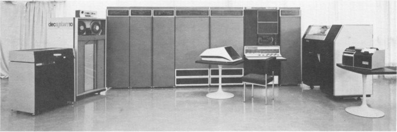
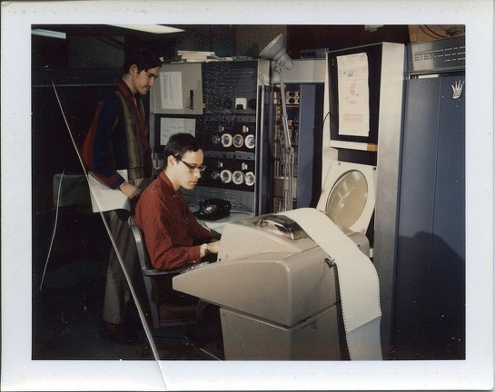
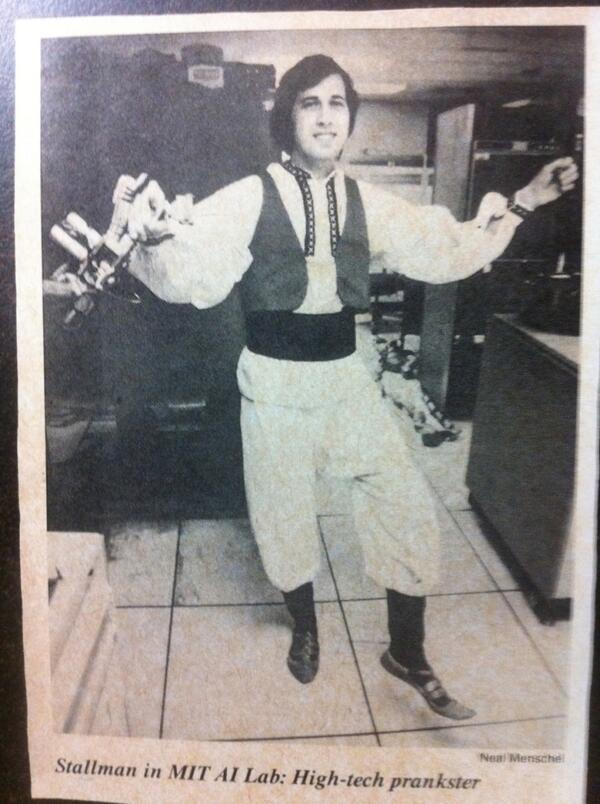

# ITS

### Incompatible Timesharing System

History, Development, and Restoration

Lars Brinkhoff

</img>

---

### Overview

- What is ITS?
- History
- Values
- Features
- Today
- Demo

---

### WHO AM I?

- Started with BASIC, then 68000 assembler
- Read about hackers as a kid
- Binutils PDP-11 support
- GCC PDP-10 support

</img>
</img>

---

### WHAT IS ITS?

- ITS is an operating system for PDP-10 computers.
- Created at MIT in 1967, kept running until 1990.
- Known for its openness and availability of source code.

</img>

---

### PDP-10 family

- Lifespan 1964-1988
- Generations: PDP-6, KA10, KI10, KL10, KS10
- 36-bit word length
- 18-bit address space
- Designed with Lisp in mind
- Large orthogonal instruction set
- Pleasant assembly language
- Popular on the ARPANET

</img>

---

### Before ITS

- AI group 1959
- CTSS 1961-1963
- Project MAC 1963
- Multics 1964-1967

</img>
</img>

---

### Beginnings

- At the MIT AI group
- For their PDP-6 computer
- Grew from singe-user tools
- First version 1967
- Alternative to CTSS and Multics

</img>

---

### Hacker Ethic

<ul>
<li>ITS was written by hackers</li>
<li>Designed to get work done, not an academic exercise</li>
<li>Highly interactive</li>
<li>No passwords</li>
<li>No file permissions</li>
<li>Source code for everything</li>
<li>Guests allowed</li>
</ul>

</img>

---

### Early Development

- PDP-10 1968
- Virtual memory 1970
- ARPANET 1971
- Two more machines: DM and ML

</img>
</img>

---

### Research

<ul>
<li>Robotics</li>
<li>Computer Vision</li>
<li>Logo</li>
<li>Lisp, Scheme</li>
<li>Lisp Machine</li>
<li>Macsyma</li>
<li>Programming Technology</li>
<li>Networking</li>
</ul>

</img>
</img>
</img>
</img>

---

### Heydays

- Network file system
- Memory mapped raster displays
- Space cadet-like keyboards
- MC KL10 1975
- Emacs 1976
- TCP/IP 1982

</img>
</img>

---

### Notable applications

<ul>
<li>Maclisp</li>
<li>Macsyma</li>
<li>Emacs</li>
<li>Scheme</li>
<li>SHRDLU</li>
</ul>

 

---

### Games

<ul>
<li>Spacewar!</li>
<li>MacHack VI</li>
<li>Flight simulator</li>
<li>Adventure</li>
<li>Maze War</li>
<li>Dazzle Dart</li>
<li>Moonlander</li>
<li>Zork</li>
</ul>
 

</img>
</img> 
</img>
</img>

---

### Imported Software

- Emulator for TOPS-10 and WAITS system calls.
- Collaboration between PDP-10 sites.
- TOPS-10: MACRO, LINK, CROSS, Fortran.
- WAITS: FAIL, SPELL, SUDS, TeX, PUB, GEOMED.
- CMU: Scribe.
- ITS really quite compatible!

</img>
</img>

---

### Multiprocessing

<ul>
<li>PDP-10, timesharing</li>
<li>PDP-6, stand alone</li>
<li>PDP-11, perpiherals</li>
<li>CONS, Lisp machine</li>
<li>CHEOPS, chess machine</li>
<li>GT40, vector display</li>
<li>Imlac, vector display</li>
<li>Tools and software</li>
</ul>

</img>
</img>
</img>

---

### Features and Limitations

- PCLSR, PC lusering
- Processes & processors available as files
- The debugger is the user interface
- Application command sets are similar to Emacs
- User-space device drivers
- Real-time scheduling
- Terminal-independent text output
- Just one level of directories
- File names 6+6 characters

---

### Decline

- PDP-6s and KA10s scrapped
- KS10 1985
- KL10 shipped to Sweden 1988
- Shut down 1990

---

### Legacy

<ul>
<li>GNU project</li>
<li>Emacs</li>
<li>Emacs Lisp, Common Lisp</li>
<li>Unexec</li>
<li>Info</li>
<li>Unix job control</li>
<li>"More" utility</li>
<li>Meta key</li>
</ul>

 
 
 

---

### A New Hope

- ITS running on an emulator 1992
- Put on Internet 2001
- Public ITS distribution
- Unix tools for ITS files and networking
- Restoration 2016

---

### Restoration

- Boot off magtape
- Make file system on disk
- Load ITS and a few binary programs
- Reboot into ITS
- Build system and >300 programs from source code
- Many bug fixes
- Issue tracking
- Continuous integration
- http://github.com/PDP-10/its

---

### Demo

- Booting
- DSKDMP
- DDT
- Starting ITS
- Logging in
- Emacs
- Info
- Shutting down

---

# ◊◊U
